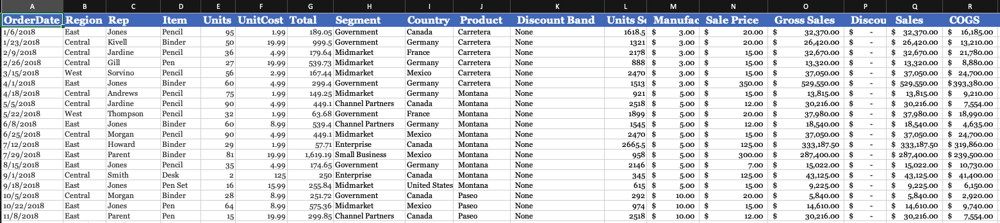

# Introduction

Microsoft Excel is everywhere in office work. The repeated work on worksheets is pretty tedious.

This instruction will help an office worker to use Python to automate some repeated office work and boost work productivity. This instruction requires basic programming knowledge to understand every step.

#### Table of Contents
- <a href="https://phil-cst-bcit.github.io/Phil-Antony-docs/#scenario-example">Scenario Example</a>
- <a href="https://phil-cst-bcit.github.io/Phil-Antony-docs/#basic-data-types">Basic Data Types</a>
- <a href="https://phil-cst-bcit.github.io/Phil-Antony-docs/#os--software">OS & Software List</a>
- <a href="https://phil-cst-bcit.github.io/Phil-Antony-docs/#time-estimate">Time Estimate</a>
- <a href="https://phil-cst-bcit.github.io/Phil-Antony-docs/#steps">Steps</a>
- <a href="https://phil-cst-bcit.github.io/Phil-Antony-docs/#typographical-conventions">Typographical Conventions</a>
- <a href="https://phil-cst-bcit.github.io/Phil-Antony-docs/#conclusion">Conclusion</a>

### Scenario Example

Let's imagine you work as an office clerk at Walmart's whole sales department. Your company is responsible to distribute a hundred thousand items from warehouses to all stores across North America. Your company needs some data to know the sales trend for each item.

One of your daily tasks is to write a summary to your boss. However, the Excel sheet you received from coworkers has one hundred thousand rows, and each row has twenty columns. Your boss told you only a few columns are needed in the report. The following table(Click to see in a new tab) shows the difficulty level of the repeated task.

Let's suppose you are going to select columns *OrderDate*, *Region*, *Item*, *Units*, *UnitCosts*, and *Total* from the original sheet. You will need to make new Excel files sorted by the *Region* column.

### Basic Data Types

Excel works with data, and the data could be numbers such as 1, 2, 3, or a word like hello. The numbers 1, 2, 3 in Python are called **_Numeric Type_**.The word "hello" refers to Data Type **_String_**.
You can't add a **_Numeric Type_** with a **_String_**.

### OS & Software

- Mac OSCatalina 10.15

- Excel 2016.35

- Python 3.7

- pip: a software for installing some helper libraries for your python program.

- pandas: first helper library

- xlrd: second helper library

- openpyxl: thrid helper library

### Time Estimate

It might takes two hours for people with little programming experiences to fully understand the whole process.

### Steps
1. [Install Python and Pycharm](https://phil-cst-bcit.github.io/Phil-Antony-docs/docs/configuration/)
2. [Configure Pycharm](https://phil-cst-bcit.github.io/Phil-Antony-docs/docs/ui-components)
3. [Download Libraries]()
4. [Write Code]()
5. [Run Code]()
6. [Fix Possible Bugs]()

### Typographical Conventions

| Convention        | Typeface           | Example  |
| ------------- |:-------------:| -----:|
| Terminal commands      | `abc` | `cd` |
| Key terms      | **_italic_**      |   **_data type_** |
| Excel Cells | *Value*                  | *Costs*  |

**Note** the note icon indicates that the following line is important.

### Conclusion

The powerful Python libraries enable the programming language to become the most suitable tool for simple office work automation. Once you grasp the basic idea of programming in Python, you will notice how amazing to let your computer working for you.

[Install Python and Pycharm](https://phil-cst-bcit.github.io/Phil-Antony-docs/docs/install)

---

### Code of Conduct

Just the Docs is committed to fostering a welcoming community.

[View our Code of Conduct](https://github.com/pmarsceill/just-the-docs/tree/master/CODE_OF_CONDUCT.md) on our GitHub repository.
